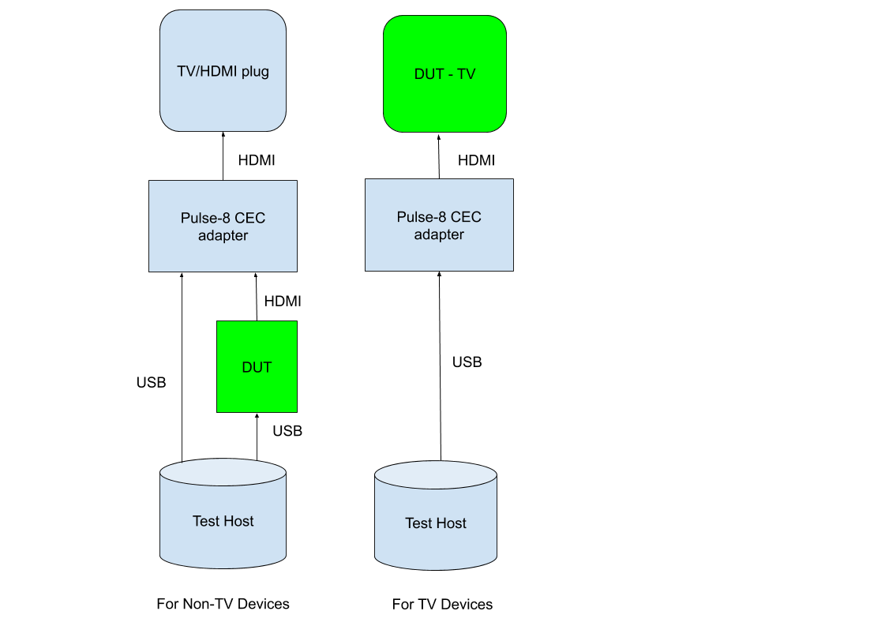

# CEC VTS testing for Android TV devices

Update existing HDMI CEC VTS (android.hardware.tv.cec@1.0.) with result validation.
Use cec-client to validate the functionality of APIs.

## Setup

### Android TV devices

Running these VTS tests requires a specific HDMI layout with a CEC adapter.

*   Android playback, TV or audio device
*   CEC adapter see [External CEC Adapter instructions](cec_adapter.md)
*   If the DUT is not a TV, then HDMI Display (any display, with CEC disabled) or an HDMI plug



### Building

From the Android root folder, after choosing the lunch combo, use `make vts10` to build VTS.
Navigate to the `out/host/linux-x86/vts10/android-vts10/tools` folder for the next step.

### Automation

On the host machine, ensure that the [software requirements](https://codelabs.developers.google.com/codelabs/android-lab/#2) for python SDK are met.

Given the setup described above you can run all of these tests with the following commands:

```
vts10-tradefed run commandAndExit vts-hal-tv -m VtsHalTvCecV1_0HostCecClient
vts10-tradefed run commandAndExit vts-hal-tv -m VtsHalTvCecV1_0Host
```

Both commands have to be run for HDMI VTS to be covered fully.
